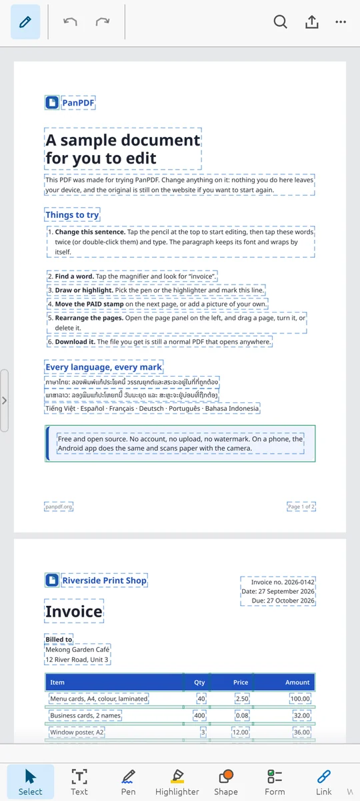

<div align="center">


# PanPDF for Android

The Android app of [PanPDF](https://github.com/panXDgaming/panpdf.rs).

### [⬇ Download PanPDF.apk](https://github.com/panXDgaming/panpdf.ad/releases/latest/download/PanPDF.apk)

Free &middot; open source &middot; no account &middot; Android 8 or newer



</div>

## Install

1. Open the link above on your phone and tap the downloaded file.
2. If Android asks, allow your browser to install apps.
3. Tap **Install**.

Not on Google Play yet. Rather not install? Use it in the browser at
[panpdf.org](https://panpdf.org).

## Build it yourself

Needs Rust (pinned in `engine/rust-toolchain.toml`) with the
`aarch64-linux-android` target, and under `~/Android/Sdk` the NDK 27.3,
build-tools 35 and platform 35. The converters come from
[pdf_tool](https://github.com/panXDgaming/pdf_tool), cloned beside
this folder.

```sh
git clone https://github.com/panXDgaming/panpdf.ad
git clone https://github.com/panXDgaming/pdf_tool
cd panpdf.ad
python3 engine/fonts/vendor.py              # the fonts the app carries
platforms/android/ocr-build.sh arm64        # Tesseract
platforms/android/tools-build.sh arm64      # the converters
platforms/android/build.sh arm64            # -> platforms/android/out/panpdf.apk
```

| Folder | What is in it |
| --- | --- |
| `platforms/android/` | the activity, the resources and the build scripts |
| `engine/crates/pdf-android` | the native library the activity loads |
| `engine/crates/pdf-window` | the editor's window, the same on every platform |
| `engine/crates/pdf-scan` | finding the page in a photo and flattening it |
| `engine/` | the rest of PanPDF's engine |

## Licence

GNU Affero General Public License 3.0, as PanPDF. The parts made by others
are listed in the app under **About PanPDF and licences**.
